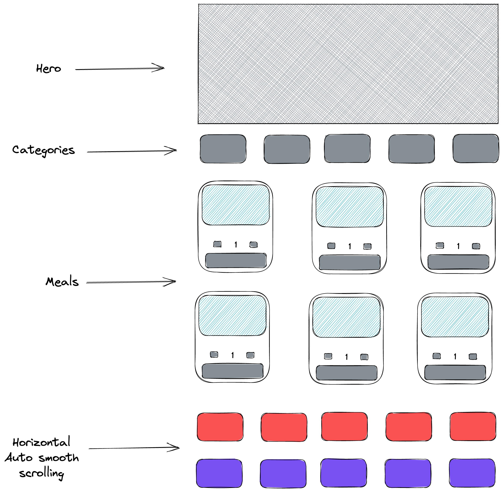

<h1 align='center'>🌭 iFood ordering App 🍔</h1>

<p align="center">
  
  Project is in progress...
</p>

## 📓 Description

iFood ordering app is a react based project that allows users to select their favorite dishes and simulate a purchase through real actions such as selecting quantity, adding/removing from cart and complete checkout.

## ⚙️ Project Status 🛠️

  ```js
    const project = {
      "status": "In Development"
    }
  ```
##


<p align="center">
  
</p>

## 🖌️ Wireframe

<p align="center">
  
</p>

## 🚀 Tech

<div>
 Javascript
</div>
<div>
 Bootstrap
</div>
<div>
 React
</div>

## ✋🏻 Pre-requisites

- [Terminal](https://www.youtube.com/watch?v=5XgBd6rjuDQ)

## 🔥 Install & Execute

1. Clone the repo;
2. Open the cloned repo;
3. Run `NPM install`
4. Run `NPM start`

## 📜 Main User Story

As a user, I want to view a catalogue of meals that I can choose from, add them to the cart and complete checkout.


## 🪩 Feature

1. Create main page with a Hero Section
2. Display catalogue of items
3. Allow users to select quantity and quantity will reflect on card price to be added
4. Create cart functionality to allow users to add and remove from cart
5. Allow users to complete checkout with a payment gateway

## 🗺 Project management

<p align="center">
  
</p>

I use ClickUp to manage implementation of project features (Kanban)


## 🏛 Role in continuous development

* Development of webpage in React
* Use of API's
* Creativity
* Agile methodology (Scrum) (Kanban)


## ☄️ Future Improvements

1. Lazy loading
2. Infinite Horizontal Autoplay smooth autoscrool Slider
3. Account creation

Made with ❤️ by Joselson and sleepless nights
